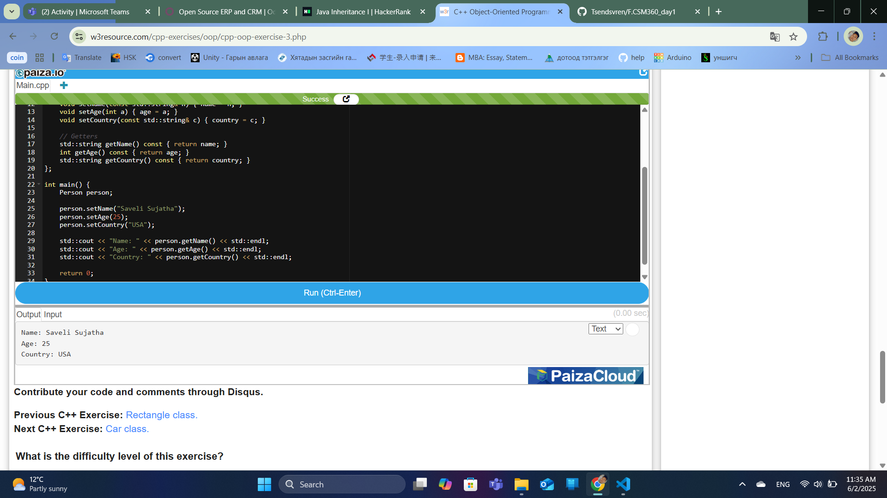
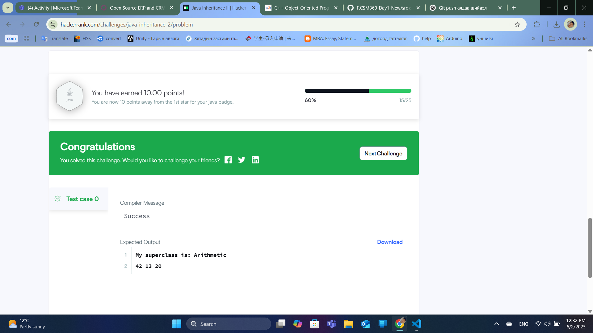

  

<h1 align="center">ШИНЖЛЭХ УХААН, ТЕХНОЛОГИЙН ИХ СУРГУУЛЬ</h1>
<h2 align="center">МЭДЭЭЛЭЛ, ХОЛБООНЫ ТЕХНОЛОГИЙН СУРГУУЛЬ</h2>

---

## АЖЛЫН ТАЙЛАН №1

---

**Хичээл:** F.CSM360 Программчлалын дадлага
**Хичээлийн жил:** 2024-2025 оны зун  

**Хичээл заасан багш:** А.Отгонбаяр /F.SW02/  
**Ажил гүйцэтгэсэн:** Оюутан - Ц.Цэндсүрэн /B242270128/  

 Улаанбаатар хот  

---

### Ажил 1-ийн үр дүн:

  

---

VSCode-ийн гаралт:

I am walking
I am flying
I am singing
---

### Ажил 2-ийн үр дүн:

  

---

VSCode-ийн гаралт:

Name: Saveli Sujatha
Age: 25
Country: USA
---

### Ажил 3-ийн үр дүн:

  

---

VSCode-ийн гаралт:

My superclass is: Arithmetic
42 13 20

✅ **ТАЙЛАН ДУУСАВ!**
